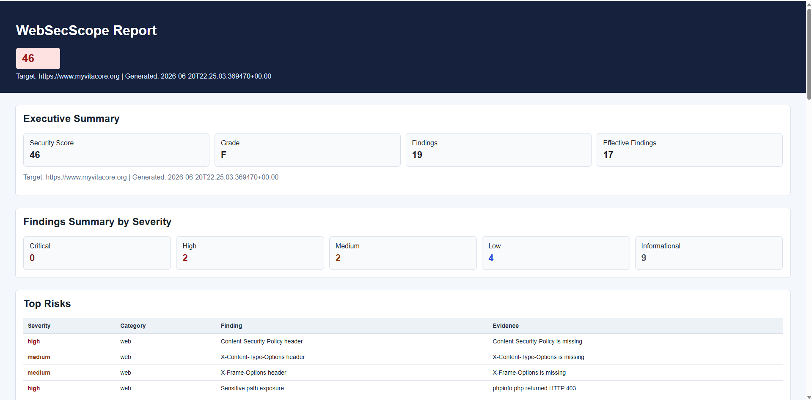
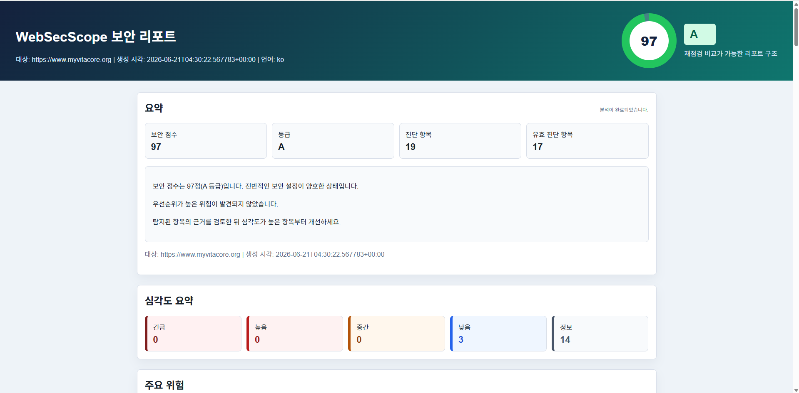
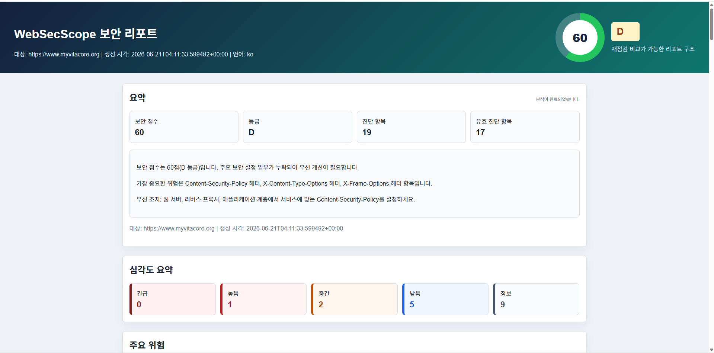

# Report System Troubleshooting

WebSecScope의 리포트 시스템을 개발하면서 발생했던 주요 문제와 해결 과정

---

# 1. AI Report가 생성되지 않거나 출력되지 않는 문제

## Problem

AI를 활용한 보안 리포트를 도입했지만 일부 환경에서는 AI 분석 결과가 출력되지 않거나 HTML 리포트에 포함되지 않는 문제가 발생.

## Cause

- AI 응답 실패 시 예외 처리가 충분하지 않았음.
- AI Formatter와 HTML Reporter의 책임이 명확하게 분리되지 않았음.
- AI 결과가 없는 경우에도 HTML이 정상적으로 생성되어야 하는 구조가 부족했음.

## Solution

- AI Formatter와 HTML Reporter를 분리하여 역할을 명확하게 정의.
- AI 호출 실패 시에도 Scanner 결과만으로 기본 리포트가 생성되는 Fallback 구조를 추가.
- AI 결과가 존재할 경우에만 AI Summary 영역을 출력하도록 개선.

## Result

- AI 호출 성공 여부와 관계없이 항상 HTML 리포트가 생성.
- AI 장애가 발생해도 Scanner 결과는 정상적으로 제공.
- 리포트 생성 안정성이 향상.

---

# 2. HTML Report의 가독성이 낮은 문제

## Problem

리포트에 많은 정보를 작은 공간에 출력하면서 다음과 같은 문제가 발생.

- 점수만 보고 현재 보안 상태를 이해하기 어려움
- 긴 문장이 카드 내부에 몰려 읽기 어려움
- 위험도와 개선 우선순위가 한눈에 보이지 않음
- 정보가 단순 나열되어 사용성이 떨어짐

## Cause

초기 HTML 리포트는 Scanner 결과를 그대로 출력하는 구조였으며, 사용자 경험(UI/UX)에 대한 고려가 부족.

## Solution

리포트 레이아웃을 전면 개선.

- Executive Summary 추가
- Security Score 의미 설명 추가
- Top Risks 영역 개선
- Findings와 상세 설명 분리
- 카드 간 여백 및 Line Height 개선
- 긴 문장의 자동 줄바꿈 적용
- 시각적 계층 구조를 재설계하여 핵심 정보를 먼저 확인할 수 있도록 개선

## Result

사용자가 리포트를 열었을 때

- 현재 보안 상태
- 가장 위험한 취약점
- 우선적으로 수정해야 할 항목

을 빠르게 이해할 수 있는 구조로 개선.

---

# 3. AI가 분석이 아닌 Findings를 그대로 나열하는 문제

## Problem

초기 AI 리포트는 Scanner에서 생성한 Findings를 단순히 다시 출력하는 수준이었음.  
실제 분석보다는 결과를 반복하는 형태였기 때문에 리포트의 활용도가 낮았음.   

## Cause

AI의 역할이 명확하지 않았으며, 단순 요약 프롬프트를 사용.  
또한 Scanner 결과를 해석하기보다 그대로 재작성하는 형태로 동작.  

## Solution

AI의 역할을 Security Analyzer가 아닌 **Report Formatter**로 재정의.

AI는

- Executive Summary 작성
- Security Score 의미 설명
- 주요 위험 요약
- 개선 우선순위 설명

만 수행하도록 변경.

또한 다음과 같은 제한을 추가.

- Scanner 결과 외 새로운 취약점 생성 금지
- CVE 생성 금지
- 위험도 변경 금지
- 근거 없는 추론 금지

## Result

AI는 새로운 보안 판단을 수행하지 않고, Scanner가 생성한 결과를 사용자가 이해하기 쉬운 형태로 설명하는 역할만 수행하도록 개선.
이를 통해 AI 환각(Hallucination)을 줄이면서도 리포트의 가독성과 활용도를 향상.

---

# 4. Security Score가 개선되지 않던 문제

## Problem

VitaCore에 HTTP 보안 헤더를 적용한 후 WebSecScope로 다시 진단했지만   
Security Score가 기존과 동일한 60점(D등급)으로 유지되었음.

백엔드에서는 보안 헤더가 정상적으로 적용된 것을 확인했지만,    
리포트에는 여전히 Content-Security-Policy, X-Frame-Options, X-Content-Type-Options 등이 누락된 것으로 표시되었음.

## Cause

초기에는 Express Backend에만 보안 헤더를 적용.

그러나 WebSecScope가 진단하는 대상은 `https://www.myvitacore.org`였으며,  
실제 응답은 Backend가 아닌 Vercel Frontend에서 제공되고 있었음.

즉, Backend에서 추가한 보안 헤더는 Public Domain의 HTML 응답에 포함되지 않았기 때문에 
Scanner에서는 여전히 보안 헤더가 없는 것으로 판단.

## Solution

Public Domain의 실제 응답 계층을 분석한 후 Frontend(Vercel)에도 동일한 보안 헤더를 적용.

- Content-Security-Policy
- X-Content-Type-Options
- X-Frame-Options
- Referrer-Policy
- Permissions-Policy

Backend Express와 Frontend Vercel 모두 동일한 보안 정책을 적용하도록 수정.

## Result

수정 후 WebSecScope를 이용해 다시 진단한 결과,

- Security Score : **60 → 97**
- Grade : **D → A**
- 주요 HTTP 보안 헤더가 정상적으로 탐지

이번 경험을 통해 실제 서비스의 보안 설정은 애플리케이션 코드뿐만 아니라 
**사용자가 실제로 접근하는 응답 계층(Hosting Layer)** 에도 동일하게 적용되어야 한다는 점을 확인.

---

## Report UI 개선 비교

초기 HTML 리포트는 점수와 진단 항목이 단순 나열되어 있어,    
사용자가 핵심 위험과 개선 우선순위를 빠르게 파악하기 어려웠음.

### Before

### After

v2.2에서는 Executive Summary, Security Score Explanation, Top Risk Cards, Detailed Finding Cards를 분리하여    
리포트의 정보 구조와 가독성을 개선했습니다.

---

## VitaCore 보안 개선 결과

WebSecScope 재진단 결과, VitaCore의 Security Score는 60점(D등급)에서 97점(A등급)으로 37점 향상되었습니다.
